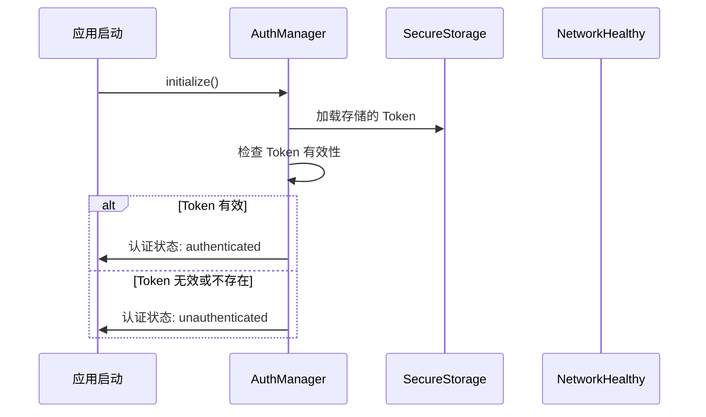
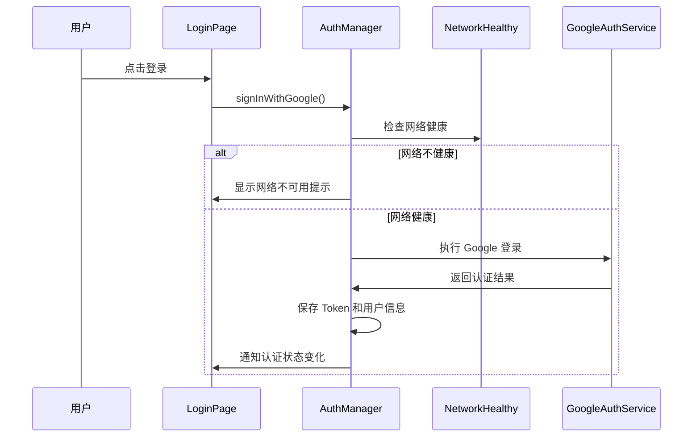
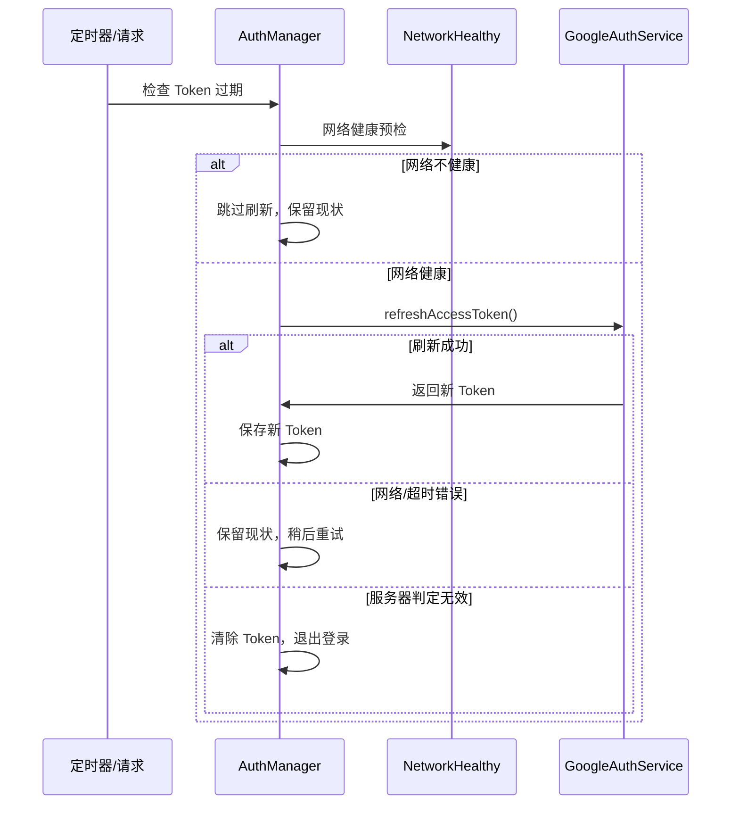

# 认证管理策略文档

## 概述

本文档详细描述了 Hushie.AI 应用的认证管理策略，包括认证状态管理、Token 生命周期管理、网络健康检查集成、失败处理机制以及优化策略。

## 目录

1. [架构概览](#架构概览)
2. [核心组件](#核心组件)
3. [认证流程](#认证流程)
4. [Token 管理策略](#token-管理策略)
5. [网络健康检查集成](#网络健康检查集成)
6. [失败处理与重试机制](#失败处理与重试机制)
7. [HTTP 客户端 401 处理](#http-客户端-401-处理)
8. [优化策略](#优化策略)
9. [安全考虑](#安全考虑)
10. [测试建议](#测试建议)

## 架构概览

认证管理系统采用事件驱动的架构，以 `AuthManager` 为核心，集成网络健康检查、HTTP 客户端服务和安全存储服务，提供统一的认证状态管理。

```
┌─────────────────┐    ┌──────────────────┐    ┌─────────────────┐
│   UI 组件层     │    │   业务逻辑层     │    │   服务层        │
├─────────────────┤    ├──────────────────┤    ├─────────────────┤
│ LoginPage       │    │ AuthManager      │    │ GoogleAuthService│
│ ProfilePage     │◄──►│ (单例模式)       │◄──►│ HttpClientService│
│ SplashPage      │    │ 认证状态管理     │    │ NetworkHealthy   │
│ ...             │    │ Token 生命周期   │    │ SecureStorage    │
└─────────────────┘    └──────────────────┘    └─────────────────┘
```

## 核心组件

### 1. AuthManager (认证管理器)

**位置**: `lib/services/auth_manager.dart`

**职责**:
- 管理认证状态和用户信息
- Token 生命周期管理和自动刷新
- 认证状态变化事件分发
- 网络健康检查集成
- 安全存储管理

**关键特性**:
- 单例模式设计
- 事件驱动的状态管理
- 自动 Token 刷新机制
- 网络健康预检
- 优雅的失败处理

### 2. HttpClientService (HTTP 客户端服务)

**位置**: `lib/services/http_client_service.dart`

**职责**:
- 统一的 HTTP 请求处理
- 401 状态码自动处理
- 请求重试机制
- 错误消息统一管理

### 3. NetworkHealthyManager (网络健康管理器)

**位置**: `lib/services/network_healthy_manager.dart`

**职责**:
- 网络连接状态检测
- 服务器健康状态检查
- 网络状态变化监听

### 4. ToastMessages (消息管理)

**位置**: `lib/utils/toast_messages.dart`

**职责**:
- 集中管理所有 Toast 消息
- 多语言支持 (英文)
- 统一的错误消息格式

## 认证流程

### 1. 应用启动流程



### 2. 用户登录流程



### 3. Token 刷新流程



## Token 管理策略

### 1. Token 存储

- **存储位置**: 使用 `SecureStorageService` 进行安全存储
- **存储内容**:
  - `accessToken`: 访问令牌
  - `refreshToken`: 刷新令牌
  - `expiresAt`: 过期时间戳
  - `userInfo`: 用户信息 JSON

### 2. Token 生命周期

```dart
class AccessTokenResponse {
  final String accessToken;
  final String refreshToken;
  final int expiresIn;
  final String tokenType;
  final int expiresAt;
  
  // 检查是否即将过期 (提前5分钟)
  bool get isExpiringSoon {
    final now = DateTime.now().millisecondsSinceEpoch ~/ 1000;
    return (expiresAt - now) <= 300; // 5分钟
  }
}
```

### 3. 自动刷新机制

- **触发条件**:
  - Token 即将过期 (提前5分钟)
  - HTTP 请求返回 401 状态码
  - 手动调用 `refreshToken()`

- **并发控制**: 使用 `Future` 缓存防止重复刷新
- **超时处理**: 35秒超时机制
- **重试策略**: 指数退避重试 (最多2次)

### 4. 失败分类处理

```dart
// 网络/超时错误 (errNo == -1 或异常)
if (result.errNo == -1 || e is TimeoutException) {
  // 保留现有登录态，不清除 Token
  return false;
}

// 服务器判定无效 (其他错误码)
else {
  // 清除 Token，退出登录态
  await clearAllAuthData();
  return false;
}
```

## 网络健康检查集成

### 1. 检查时机

- **登录前**: `signInWithGoogle()` 调用前
- **Token 刷新前**: `_performTokenRefresh()` 调用前

### 2. 检查逻辑

```dart
Future<bool> _ensureNetworkHealthy({String action = ''}) async {
  try {
    final status = await NetworkHealthyManager.instance.checkNetworkHealth();
    if (status == NetworkHealthStatus.healthy) {
      return true;
    }
    ToastHelper.showError(ToastMessages.networkUnavailable);
    return false;
  } catch (e) {
    ToastHelper.showError(ToastMessages.networkCheckFailed);
    return false;
  }
}
```

### 3. 网络状态类型

- `NetworkHealthStatus.healthy`: 网络健康
- `NetworkHealthStatus.noConnection`: 无网络连接
- `NetworkHealthStatus.serverUnhealthy`: 服务器不健康
- `NetworkHealthStatus.error`: 检查异常

## 失败处理与重试机制

### 1. AuthManager 重试策略

```dart
// Token 刷新重试 (指数退避)
for (int i = 1; i <= 2; i++) {
  final delayMs = 1000 * i; // 1秒, 2秒
  await Future.delayed(Duration(milliseconds: delayMs));
  bool success = await _performTokenRefresh();
  if (success) return true;
}
```

### 2. isSignedIn() 优化策略

- **软失败**: 刷新失败时不立即清除登录态
- **保留现状**: 允许后续重试或定时器处理
- **异常处理**: 仅在严重异常时清除认证数据

### 3. 错误分类

| 错误类型 | 处理策略 | 示例 |
|---------|---------|------|
| 网络错误 | 保留登录态，稍后重试 | 网络超时、连接失败 |
| 服务器无效 | 清除登录态，退出登录 | 401 Unauthorized |
| 系统异常 | 清除登录态，安全退出 | 存储异常、解析错误 |

## HTTP 客户端 401 处理

### 1. 统一 401 处理流程

```dart
// 检测到 401 状态码
if (response.statusCode == 401) {
  // 尝试刷新 Token
  final refreshed = await AuthManager.instance.refreshToken();
  if (refreshed) {
    // 刷新成功，重发原请求
    return await request();
  } else {
    // 刷新失败，显示认证过期提示
    ToastHelper.showError(ToastMessages.authExpired);
    return response; // 返回原 401 响应
  }
}
```

### 2. 重试配置

- **最大重试次数**: 3次
- **重试间隔**: 500ms
- **重试状态码**: [404, 500, 502, 503, 504]
- **401 特殊处理**: 单独的 Token 刷新重试

### 3. 错误消息管理

所有 HTTP 错误消息统一通过 `ToastMessages` 管理，支持:
- 状态码错误消息
- 网络异常消息
- 认证相关消息

## 优化策略

### 1. 已实现的优化

#### 网络健康预检
- **目的**: 避免网络问题导致的误登出
- **实现**: 登录和刷新前检查网络状态
- **效果**: 减少因网络问题导致的认证失败

#### 失败分类处理
- **目的**: 区分网络错误和认证错误
- **实现**: 根据错误类型采用不同处理策略
- **效果**: 提高系统容错性

#### 指数退避重试
- **目的**: 优雅处理临时网络问题
- **实现**: Token 刷新失败时进行2次退避重试
- **效果**: 提高刷新成功率

#### 统一 401 处理
- **目的**: 自动处理认证过期问题
- **实现**: HTTP 客户端自动刷新 Token 并重试
- **效果**: 提升用户体验

### 2. 性能优化

#### 并发控制
```dart
// 防止重复刷新
if (_refreshFuture != null) {
  return await _refreshFuture!;
}
```

#### 批量存储读取
```dart
// 一次性读取所有认证数据
final authData = await SecureStorageService.getAllAuthData();
```

#### 缓存机制
- Token 内存缓存
- 设备 ID 缓存
- 动态签名缓存

### 3. 用户体验优化

#### 统一错误提示
- 集中管理错误消息
- 英文用户友好提示
- 避免技术术语

#### 状态透明化
- 实时认证状态通知
- 详细的调试日志
- 清晰的状态流转

## 安全考虑

### 1. Token 安全

- **安全存储**: 使用系统安全存储服务
- **内存保护**: 避免 Token 长期驻留内存
- **传输安全**: HTTPS 加密传输

### 2. 认证流程安全

- **超时控制**: 防止长时间等待
- **重试限制**: 避免无限重试
- **状态验证**: 严格的状态检查

### 3. 错误处理安全

- **信息泄露防护**: 不在日志中输出敏感信息
- **异常处理**: 优雅处理所有异常情况
- **安全退出**: 异常时安全清除认证数据

## 测试建议

### 1. 网络条件测试

```bash
# 弱网络环境测试
- 网络延迟 > 5秒
- 间歇性网络中断
- DNS 解析失败

# 服务器异常测试
- 服务器返回 500 错误
- 服务器超时
- 服务器返回无效响应
```

### 2. Token 生命周期测试

```bash
# Token 过期测试
- 手动设置过期时间
- 模拟服务器时间不同步
- 测试自动刷新机制

# 无效 Token 测试
- 使用过期的 refresh_token
- 使用被撤销的 token
- 测试服务器 401 响应
```

### 3. 并发场景测试

```bash
# 并发刷新测试
- 多个请求同时触发刷新
- 应用启动时的并发检查
- 网络恢复时的批量重试
```

### 4. 异常恢复测试

```bash
# 应用生命周期测试
- 应用后台/前台切换
- 应用强制关闭重启
- 系统重启后的状态恢复

# 存储异常测试
- 存储空间不足
- 存储权限被拒绝
- 存储数据损坏
```

## 监控和调试

### 1. 日志系统

```dart
// 认证相关日志前缀
debugPrint('🔐 [AUTH] 认证状态变化: $status');
debugPrint('🔄 [RETRY] Token刷新重试: $attempt');
debugPrint('🌐 [NETWORK] 网络健康检查: $status');
```

### 2. 关键指标监控

- Token 刷新成功率
- 网络健康检查成功率
- 401 处理成功率
- 用户登录成功率

### 3. 异常监控

- Token 刷新失败次数
- 网络检查异常次数
- 认证流程异常次数
- 存储操作失败次数

## 总结

本认证管理策略通过以下关键特性确保了系统的稳定性和用户体验:

1. **网络健康预检**: 避免网络问题导致的误登出
2. **智能失败处理**: 区分网络错误和认证错误
3. **自动重试机制**: 指数退避和统一 401 处理
4. **事件驱动架构**: 实时状态同步和响应
5. **安全存储管理**: 保护用户认证数据
6. **统一错误管理**: 用户友好的错误提示

这些优化策略显著降低了因网络问题导致的登录状态丢失，提升了应用的可靠性和用户满意度。

---

**文档版本**: 1.0  
**最后更新**: 2024年12月  
**维护者**: Hushie.AI 开发团队